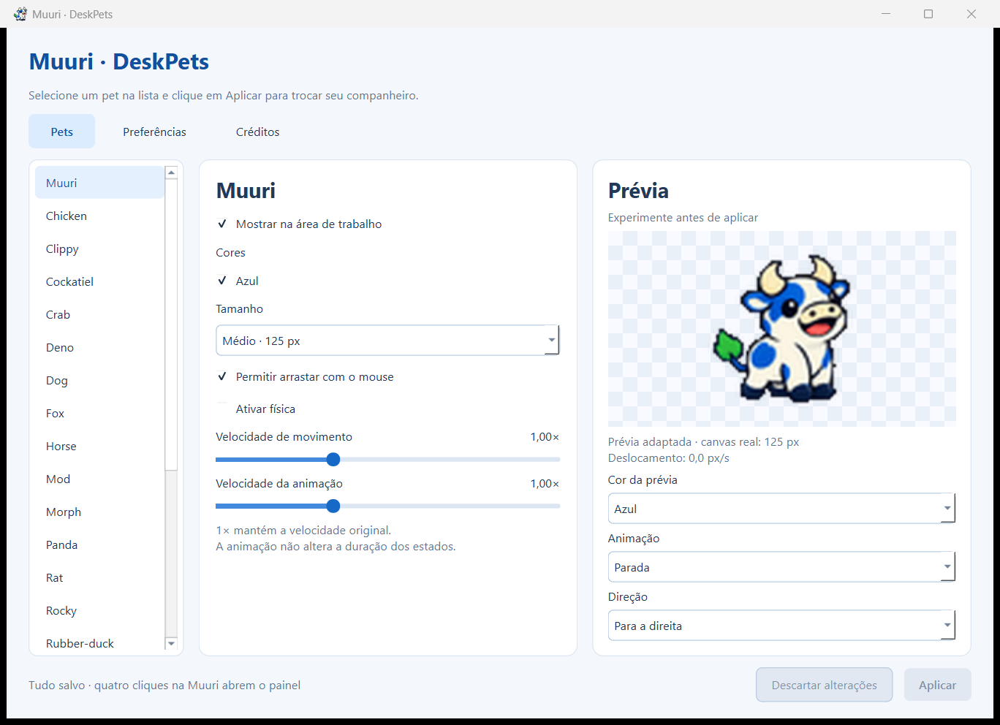

# Muuri 🐮

Uma vaquinha de desktop para Windows, baseada no [DeskPets](https://github.com/Jumitti/DeskPets).
Mantém Python/PyQt e adiciona painel em português, arraste e física opcional.

## Instalar

Baixe **Muuri-Setup.exe** na [página de versões](https://github.com/Felipx423/muuri/releases/latest),
abra e conclua a instalação. Não precisa de Python nem VS Code.
Para Windows 10/11 de 64 bits. O instalador 1.0.1 tem aproximadamente 31 MB.
Ele cria atalhos no menu Iniciar e na área de trabalho; só uma instância abre por sessão.
O aplicativo ainda não possui assinatura digital própria.

## Usar

- Dê quatro cliques rápidos na Muuri para abrir as configurações.
- Arraste com o mouse. Ative a física no painel para gravidade, arremesso e quique.
- Ajuste pet, tamanho, velocidades e camada; clique em **Aplicar** para salvar.
- Use o ícone da bandeja, perto do relógio, para abrir o painel ou sair.
- Desinstale em **Configurações do Windows → Aplicativos**. As preferências ficam preservadas.



## Executar pelo código

No Windows, na raiz do projeto:

```powershell
python -m venv .venv
.\.venv\Scripts\python.exe -m pip install -r requirements.txt
.\.venv\Scripts\python.exe run.py
```

Para validar:

```powershell
.\.venv\Scripts\python.exe -m unittest discover -s tests -v
```

Para compilar o instalador, consulte [packaging/README.md](packaging/README.md).

## Créditos e licenças

Base **DeskPets**, de **Minniti Julien (Jumitti)**, sob licença MIT preservada em [LICENSE](LICENSE).
O projeto original é inspirado em **vscode-pets**, de **tonybaloney**; os créditos das mídias originais continuam aplicáveis.
Muuri foi adaptada a partir da referência visual fornecida pelo usuário.
A distribuição executável inclui PyQt6 sob GPL v3, seu código-fonte e as licenças das bibliotecas.
Os assets do código-fonte incluído ficam em `_internal/deskpets/media`; veja as instruções no ZIP.

<details>
<summary>Documentação original do DeskPets</summary>

# DeskPets 🐶 🐿️

Desktop pets for Windows. Directly and explicitly inspired by 
[**vscode-pets**](https://github.com/tonybaloney/vscode-pets)
by [**tonybaloney**](https://github.com/tonybaloney). 
This project adopts the same core idea, small pixel creatures living on your workspace.


## Installation (Windows only)

### Option 1 — Python 

```bash
pip install deskpets
```

And to run, in CMD.exe (according to have python in your PATH):

```bash
deskpets
```

### Option 2 — Executable

Download the `DeskPets.zip` from the [**Release**](https://github.com/Jumitti/DeskPets/releases) section, extract it, and run `DeskPets.exe`.

## Usage

Launching the application spawns one or more pets in the bottom-left corner of the screen.

Current behavior:

* Unlimited number of pets
* Some species support multiple color variations
* Per-species size control
* Position automatically adapts to the taskbar
* Simple interaction: some pets sit when the cursor gets close

## Settings


## Missing Features

* Bunny, cat, frog (assets not licensed yet)
* Background system
* Ball play mechanic

## Version

[CHANGELOG](CHANGELOG.md)

## Credits

This project is inspired by [**vscode-pets**](https://github.com/tonybaloney/vscode-pets)
by [**tonybaloney**](https://github.com/tonybaloney).

All media used in this project originates from that repository, and the original credits provided there apply here as well.

</details>
